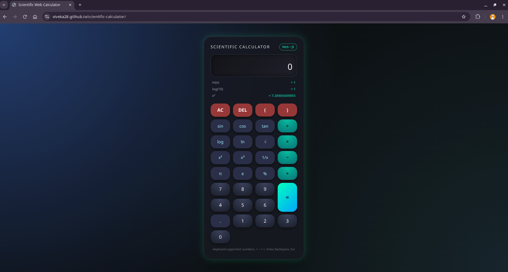

# Scientific Web Calculator

A browser-based scientific calculator built with vanilla HTML, CSS, and JavaScript — no frameworks, no dependencies.

**[Live Demo →](https://viveka28.github.io/scientific-calculator/)**



## Features

- Standard arithmetic (add, subtract, multiply, divide)
- Scientific functions: sin, cos, tan (degree-based), log, ln, square root, square, cube, inverse
- Constants: π, e
- Percentage and parenthesis support
- Token-based expression engine — builds and evaluates chained expressions in real time, keeping the displayed string and the evaluated string in sync
- Calculation history panel (last 5 results)
- Full keyboard support (numbers, operators, Enter, Backspace, Escape)
- Edge-case handling: undefined results (e.g. tan(90°)) are caught and shown clearly instead of crashing; floating-point rounding errors (e.g. `6e-17`) are cleaned up to `0`
- Input sanitization guard before evaluation, restricting the expression to a whitelist of safe characters and function names

## Tech Stack

- HTML5
- CSS3 (glassmorphism UI, responsive layout, custom animations)
- Vanilla JavaScript (ES6+)

## Why a token-based design?

Instead of directly building a raw string for `eval()`, every button press pushes a token object `{ disp, eval }` onto an array — one value for what's shown on screen (e.g. `sin(`) and one for what's actually evaluated (e.g. `window.sin(`). This keeps the visible expression human-readable while letting the evaluation logic stay separate and controlled, and makes operations like backspace trivial (just pop the last token).

## Running Locally

Clone the repo and open `index.html` directly in a browser — no build step or server required.

```bash
git clone https://github.com/VivekA28/scientific-calculator.git
cd scientific-calculator
open index.html   # or just double-click the file
```

## Known Limitations / Future Improvements

- Uses JavaScript's `eval()` guarded by a character/identifier whitelist; a production version would replace this with a proper expression parser (e.g. `math.js`) for stronger safety guarantees
- No persistent history across sessions (resets on page reload) — could be added with `localStorage`
- No unit/radian toggle for trig functions (currently degree-only)

## License

MIT
